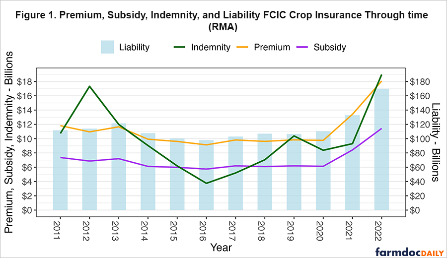
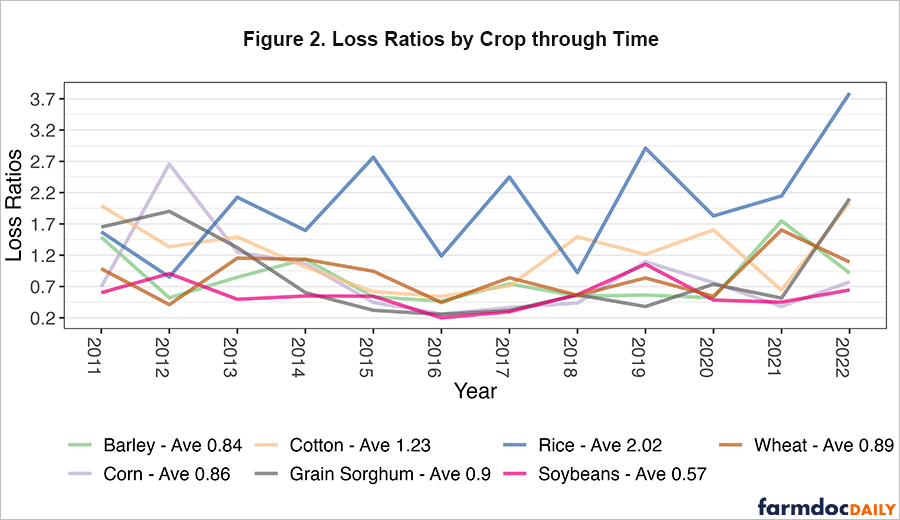

# Weekly Farm Economics: Understanding the Relationship between Loss Ratios and Crop Insurance Subsidies

**Ivan Flores, Nick Paulson, Jonathan Coppess, Gary Schnitkey, and Bruce Sherrick**  
Department of Agricultural and Consumer Economics  
University of Illinois  

**November 21, 2023**  
*farmdoc daily* **(13): 212**

---

## Recommended citation format

Flores, I., N. Paulson, J. Coppess, G. Schnitkey, and B. Sherrick. “Understanding the Relationship between Loss Ratios and Crop Insurance Subsidies.” *farmdoc daily* (13): 212, Department of Agricultural and Consumer Economics, University of Illinois at Urbana-Champaign, November 21, 2023.

**Permalink:**  
https://farmdocdaily.illinois.edu/2023/11/understanding-the-relationship-between-loss-ratios-and-crop-insurance-subsidies.html

---

The purpose of this article is to document the relationship between actual subsidy rates and loss ratios in crop insurance products, and to provide implications for policy initiatives that are being discussed related to changing subsidy rates on specific insurance products.

Federally sponsored crop insurance programs have grown dramatically through time to the point that they cover the majority of the commercially grown crops in the US with total annual premiums around **$18 billion** and liability around **$180 billion/year**. Crop insurance is broadly regarded as the primary risk management program for crop producers, and participation is likewise high with individual revenue and yield policies covering about **87%** of total corn, soybeans, and wheat acres—the largest three crops by value of production in the program.

Features of the crop insurance program include a Congressional mandate to set premiums that result in a long-run break-even performance, including a reasonable reserve. This means that total indemnity payments—i.e., the amount paid out in claims for crop losses—should equal total premiums collected through time (7 U.S.C. §1506). To encourage participation in crop insurance and to avoid problems related to rating individuals with varying degrees of accuracy, the Federal Crop Insurance Corporation (FCIC) subsidizes premiums and also stands behind a portion of any losses/gains to the Approved Insurance Providers (AIPs) through required participation of companies in the Standard Reinsurance Agreement (SRA). Premium subsidy rates vary by unit design and coverage level based on both policy goals and insurance type.

The policy intent and justification for premium subsidy is that if there is broad enough participation in crop insurance, then there would not be a need for *ad hoc* disaster payments, which are typically less targeted and can be more costly than insurance payments tied to actual individual losses.

---

##### Figure 1. Total federally sponsored crop insurance premium, subsidy, indemnity, and liability levels across major programs over time

---

> We request all readers, electronic media and others follow our citation guidelines when re-posting articles from *farmdoc daily*. Guidelines are available here. The *farmdoc daily* website falls under University of Illinois copyright and intellectual property rights. For a detailed statement, please see the University of Illinois Copyright Information and Policies here.

---

## Loss ratios and basic identities

The ratio of indemnity payments to premiums collected is termed the **loss ratio**. If the loss ratio (indemnity/premium) equals **1.0** on average through time, then the program is considered to be actuarially fair as mandated by statute. Historical performance of the entire crop insurance program indicates that this mandate is being met at the program level: the overall loss ratio for the entire program (all policies and areas) from **2011 to 2022** has been **0.87**, but varies widely across crops and policy types.

Other basic facts and relationships among premiums, liabilities, and indemnities include:

- For any given insurance policy, the **premium rate** = premium / liability.
- The **loss rate** = indemnity / liability. This fraction would also equal the premium rate on average through time if the policy is accurately rated and no other loadings or reserves exist.
- Completing the identity: (premium rate) × (liability) = premium. The premium is in dollars (not a fraction) and is proportional to the potential size and likelihood of losses (the value being insured and the amount of risk involved).
- Higher deductible policies (lower coverage levels) should cost less, and lower deductible policies (higher coverage) should cost more, all else equal.
- The **subsidy rate schedule**—the share of the premium paid by the federal government—is set by congressional policy. The farmer pays (1 − subsidy rate) × premium as their out-of-pocket cost for insurance.

---

## FCIC subsidy rates by unit and coverage level

Table 1 shows stated FCIC subsidy rates by unit and coverage level for individual yield and revenue products. In general, stated subsidy rates decline as the producer-elected coverage level increases, meaning the farmer pays a higher share of policy cost. For example, the producer-paid portion for a **basic unit 85% Revenue Protection (RP)** policy would be **62%** of the premium, while the government would pay **38%**.

---

##### Table 1. FCIC subsidy rate by unit and coverage election

| Unit | 50% | 55% | 60% | 65% | 70% | 75% | 80% | 85% |
|---|---:|---:|---:|---:|---:|---:|---:|---:|
| Enterprise | 80% | 80% | 80% | 80% | 80% | 77% | 68% | 53% |
| Basic and Optional | 67% | 64% | 64% | 59% | 59% | 55% | 48% | 38% |

---

As the Farm Bill debate advances, several proposals to modify subsidy rates associated with various products and coverage levels have been proposed to promote producer participation in specific products, regions, or cases. One example proposal was reviewed previously (see *farmdoc daily*, June 27, 2023).

Proponents of crop insurance generally look for ways to create higher effective coverage and lower effective costs, while opponents often cite high subsidy rates and program costs as a drawback. Both sides frequently use the term “subsidy rate” to compare costs across coverage levels, crops, and regions. However, accurate characterization of **effective** (realized) subsidy requires a deeper understanding of policy performance. Because this is an insurance program, premiums should vary with actuarial implications, and subsidy interpretation depends critically on that context.

In simplest form, stated subsidy rates are only accurate if the loss ratio equals **1.0**. If insurance is overpriced and the resulting loss ratio is less than 1.0, then part of the subsidy is “used up” by mis-rating. If insurance is underpriced and the loss ratio is greater than 1.0, then the effective subsidy rate is amplified by excess payments relative to premiums collected.

---

## Effective subsidy: why loss ratios matter

To understand the impact of loss ratios on effective subsidy, consider the distribution of crop insurance costs and payments across various loss ratios and subsidy rates shown in Table 2. For simplicity, cases are presented **per dollar of premium**, and results scale proportionally with premium.

The table is presented in three panels:

- **Panel 1:** stated subsidy rate fixed at 40% across loss ratio cases from 0.5 to 2.5.
- **Panel 2:** repeats patterns with a stated subsidy rate of 60%.
- **Panel 3:** varies both loss ratios and subsidy rates to illustrate additional policy-relevant cases.

In Panel 1, for example, when the farmer pays $0.60 and receives $0.50 in indemnity, the implied rate of return on farmer-paid premium is −17%. The **effective premium subsidy rate** captures the share of total premium that ultimately accrues to the farmer once indemnities are realized:

\[
\text{Effective subsidy rate} = \frac{\text{Indemnity} - \text{Farmer premium}}{\text{Total premium}}
\]

This equals the stated subsidy rate **if and only if** the loss ratio equals 1.0. When loss ratios depart from 1.0, effective subsidy rates can diverge sharply from stated subsidy schedules.

Panel 3 highlights cases where the “subsidy” can be entirely offset by overrating (loss ratio < 1.0), and cases where underpricing (loss ratio > 1.0) yields effective subsidy rates far above stated levels. These examples illustrate why policy discussions focused on subsidy rates alone—without accounting for rating accuracy and realized loss experience—can be misleading.

---

##### Table 2. Distribution of crop insurance impacts by loss ratio and subsidy rate (per $1 of premium)

| Total Premium | Loss Ratio | Indemnity | Subsidy Rate | FCIC Premium | Farmer Premium | Farmer (Loss) / Gain % | Effective Subsidy Rate | Total Gain/Loss |
|---:|---:|---:|---:|---:|---:|---:|---:|---:|
| $1.00 | 0.50 | $0.50 | 0.40 | $0.40 | $0.60 | -17% | -10% | $0.50 |
| $1.00 | 1.00 | $1.00 | 0.40 | $0.40 | $0.60 | 67% | 40% | $0.00 |
| $1.00 | 1.50 | $1.50 | 0.40 | $0.40 | $0.60 | 150% | 90% | ($0.50) |
| $1.00 | 2.00 | $2.00 | 0.40 | $0.40 | $0.60 | 233% | 140% | ($1.00) |
| $1.00 | 2.50 | $2.50 | 0.40 | $0.40 | $0.60 | 317% | 190% | ($1.50) |
| $1.00 | 0.50 | $0.50 | 0.60 | $0.60 | $0.40 | 25% | 10% | $0.50 |
| $1.00 | 1.00 | $1.00 | 0.60 | $0.60 | $0.40 | 150% | 60% | $0.00 |
| $1.00 | 1.50 | $1.50 | 0.60 | $0.60 | $0.40 | 275% | 110% | ($0.50) |
| $1.00 | 2.00 | $2.00 | 0.60 | $0.60 | $0.40 | 400% | 160% | ($1.00) |
| $1.00 | 2.50 | $2.50 | 0.60 | $0.60 | $0.40 | 525% | 210% | ($1.50) |
| $1.00 | 0.70 | $0.70 | 0.30 | $0.30 | $0.70 | 0% | 0% | $0.30 |
| $1.00 | 0.30 | $0.30 | 0.70 | $0.70 | $0.30 | 0% | 0% | $0.70 |
| $1.00 | 1.00 | $1.00 | 0.38 | $0.38 | $0.62 | 61% | 38% | $0.00 |
| $1.00 | 0.57 | $0.57 | 0.38 | $0.38 | $0.62 | -8% | -5% | $0.43 |
| $1.00 | 2.21 | $2.21 | 0.38 | $0.38 | $0.62 | 256% | 159% | ($1.21) |

**Nota:** Paneles y celdas sombreadas en la fuente original ilustran casos donde la equivalencia entre subsidio efectivo y subsidio declarado se cumple (loss ratio = 1.0) y otras combinaciones comparables.

---

## Loss ratios by crop and policy implications

Because “subsidy rate” corresponds to a program-level subsidy only if loss ratios equal 1.0, it is also reasonable to assess actual crop insurance loss performance by crop, region, coverage level, and unit choice both for selecting insurance and evaluating long-term performance.

##### Figure 2. Loss Ratios by Crop through Time

Figure 2 shows total loss ratios over time by crop, aggregated across policies and coverage levels based on observed shares of use through time (for more detail, see *farmdoc daily*, January 17, 2023). Soybeans, for example, have had low loss experience and thus provide less effective subsidy than suggested by the stated schedule. Of course, effective subsidy is generally not the primary motivation for crop insurance adoption—downside risk protection remains the central feature. Still, participation may rationally respond to long-run program economics as performance accumulates through time.

In practice, it may be preferable to improve rating accuracy to meet participation objectives rather than altering subsidy rates or relying on extremely high subsidy rates to attract participation into low-loss products. Moreover, higher loss-rate situations already experience effective subsidy rates above stated rates. Understanding the relationship between loss experience and subsidy schedules is therefore essential before changing premiums or subsidies.

In summary, crop insurance remains a critical risk management program, and subsidy considerations are typically secondary in policy selection. Nonetheless, stated subsidy rates are not fully accurate measures of realized subsidy when loss ratios depart from 1.0. When loss ratios are higher than 1.0, effective subsidies exceed stated rates; when loss ratios are below 1.0, effective subsidies are lower than mandated. Persistent imbalances challenge both program integrity and fairness for farmers making annual purchase and risk management decisions—issues warranting further research.

---

## References

Schnitkey, G., B. Sherrick, N. Paulson, C. Zulauf, J. Coppess and J. Baltz. “Premium Support and Crop Insurance: An Analysis of the Proposed 4% Farmer-Premium Payment Cap.” *farmdoc daily* (13):117, Department of Agricultural and Consumer Economics, University of Illinois at Urbana-Champaign, June 27, 2023.

Schnitkey, G., C. Zulauf, N. Paulson and J. Baltz. “Crop Insurance for Soybeans: The Low Loss Ratio Concern.” *farmdoc daily* (13):8, Department of Agricultural and Consumer Economics, University of Illinois at Urbana-Champaign, January 17, 2023.
