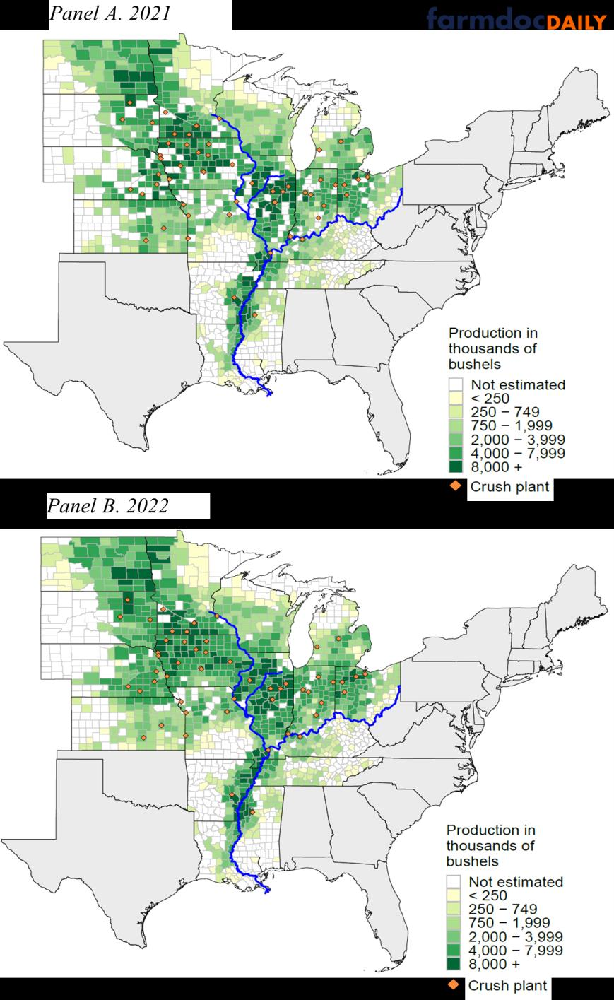
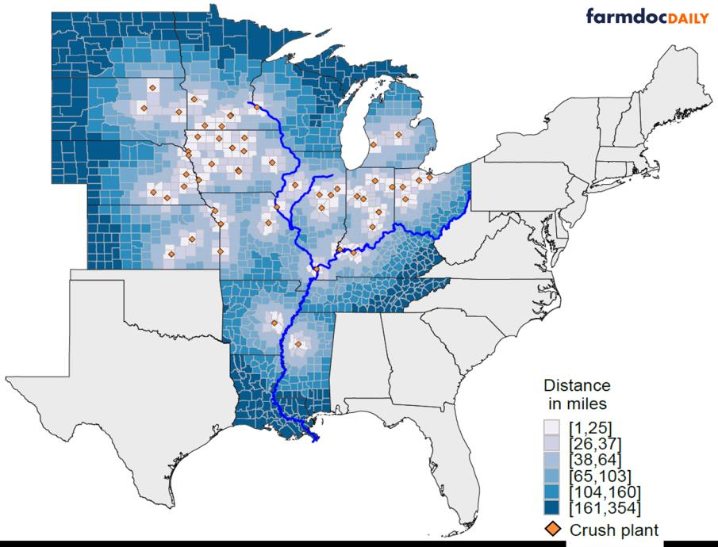
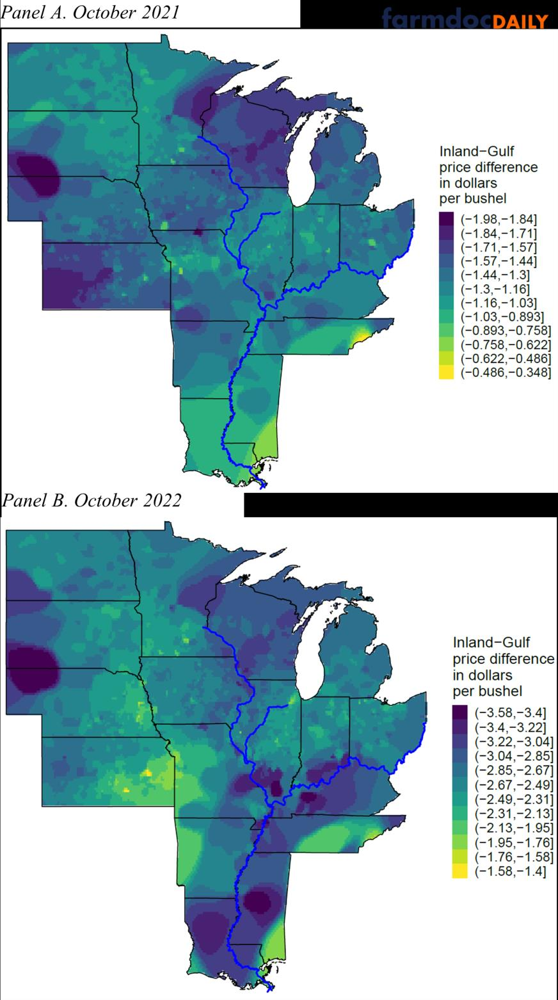
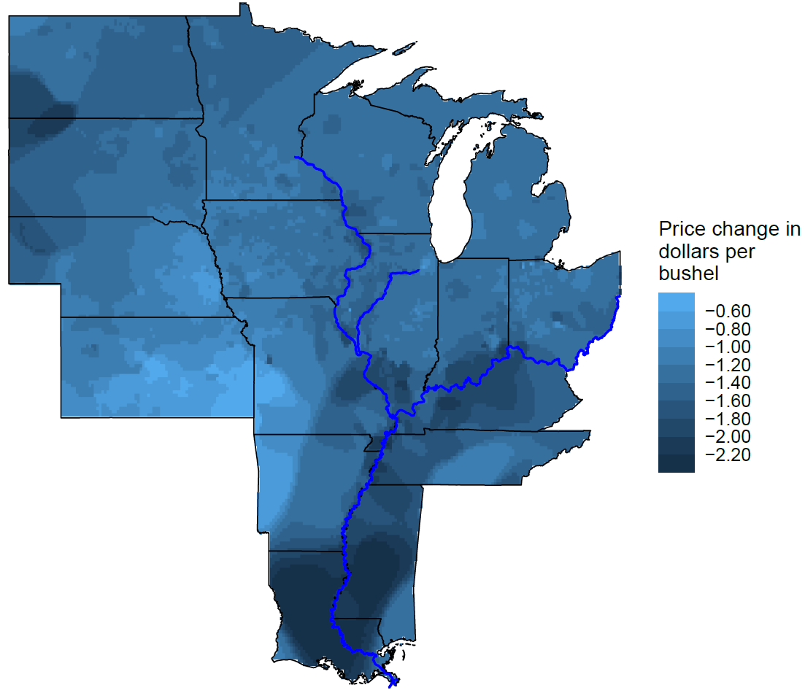
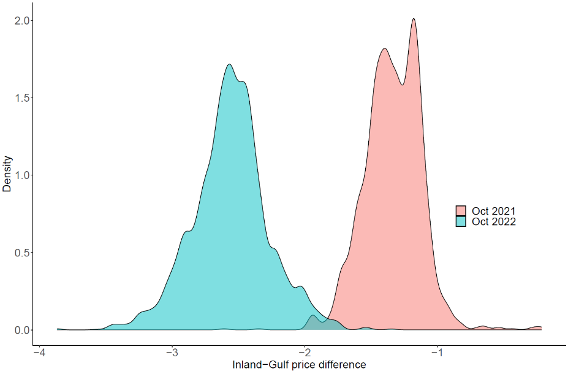

# Drought, Low River Water Levels, and Local Soybean Markets: The Role of Physical and Economic Distance

**Ivan Flores and Joe Janzen**  
Department of Agricultural and Consumer Economics  
University of Illinois  

**April 3, 2023**  
*farmdoc daily* **(13): 61**

#### Recommended citation format

Flores, I and J. Janzen. “Drought, Low River Water Levels, and Local Soybean Markets: The Role of Physical and Economic Distance.” *farmdoc daily* (13): 61, Department of Agricultural and Consumer Economics, University of Illinois at Urbana-Champaign, April 3, 2023.

**Permalink:**  
https://farmdocdaily.illinois.edu/2023/04/drought-low-river-water-levels-and-local-soybean-markets-the-role-of-physical-and-economic-distance.html

---

The Mississippi River is a critical commercial agricultural route in the US Midwest. The Mississippi and its major tributaries connect the major grain and oilseed production area of the United States to ocean transport to major export markets. In October 2022, drought caused Mississippi River water levels to reach their lowest point in a decade. Figure 1 shows satellite images of the dramatic change in the width of the river’s main channel between October 2022 and the year prior. Consequently, commercial traffic slowed with barges carrying much of the Midwest’s grain, fertilizer, and other commodities subject to loading limits.

This article describes the market dislocation in US soybean prices in fall 2022. We consider how this dislocation varied by location relative to observed year-to-year changes in soybean production. The United States produces roughly four billion bushels of soybeans annually. Roughly half of all US soybeans are exported, with the other half processed at domestic crushing facilities near major production areas in the Midwest. The value of a bushel of soybeans depends in part on its proximity to one or both demand sources: export shipping terminals and domestic crush plants. Our focus on production and prices complements an earlier article (See *farmdoc daily*, November 2, 2022) describing the effect of the 2022 drought on grain movement, transportation costs, and price levels.

Drought in the US Midwest in 2022 affected both the physical distance and economic distance between production and use of US soybeans. Though the physical distance in miles between US cropland, domestic soybean processors, and export terminals did not change in 2022, soybean production can move closer or further from use locations over time. Weather events affect where US soybeans are produced by influencing local yields with production impacts larger in some areas than others.

> We request all readers, electronic media and others follow our citation guidelines when re-posting articles from *farmdoc daily*. Guidelines are available here. The *farmdoc daily* website falls under University of Illinois copyright and intellectual property rights. For a detailed statement, please see the University of Illinois Copyright Information and Policies here.

---

##### Figure 1. Satellite Images of the Mississippi River Near Eudora, Arkansas, October 2021 and October 2022

**Source:** European Union Copernicus Sentinel-3 imagery  
https://www.copernicus.eu/en/media/image-day-gallery/drought-plagues-mississippi-river

---

The economic distance between soybean producing and consuming locations, measured by differences in prices across locations, is also constantly changing. Drought-related disruptions in river shipping raised the per-bushel cost of soybean transportation and increased the economic distance between inland production areas and export markets. This transportation cost change similarly affected locations more than others. This article considers how these physical and economic distances change over time and how drought and low river levels affected distance in the fall of 2022.

To assess relative changes in physical and economic distance, we visualize the distribution of US soybean production and prices across space in both 2021 and 2022. We measure the distance from actual production locations to nearby domestic soybean crush plants and the main export location for US soybeans at New Orleans on the Gulf of Mexico. We show that the average physical distance of a bushel of soybeans to these locations changes only slightly between 2021 and 2022. However, the economic distance between US soybean production locations, crush plants, and export terminals changed much more. Soybeans became much more valuable at the Gulf and comparatively less valuable inland. The range of local spot prices grew as the impact of 2022 market conditions varied significantly across space. Our data visualizations show that in the short run, local soybean prices are highly responsive to changing commodity flows, working to allocate the commodity across space.

---

### How Close Is US Soybean Production to End-Use Locations?

Soybeans are mainly grown in the US Midwest; the top five producing states are Illinois, Iowa, Minnesota, Nebraska, and Indiana. US soybean production in 2021 was 4.46 billion bushels, a record high largely due to favorable weather conditions and high yields. Production in 2022 was 4.28 billion bushels, down 4% from 2021, even though US soybean planted acreage was up slightly from the year prior.

After harvest, soybeans are transported to processing facilities often called crush plants and converted to soybean meal and oil. Meal and oil have many uses, including animal feed, food ingredients, and transportation fuel. Figure 2 shows the county-level production data for 2021 (panel A) and 2022 (panel B). Both panels also show the location of processing plants and the three major waterways used for barge transportation, the Mississippi, Ohio, and Illinois Rivers. Much of the US soybean production is in areas connected to river shipping. Counties near the Illinois River display high production as well as locations around the Mississippi River in Tennessee, southeast Missouri, Arkansas and Mississippi. Significant quantities of soybeans are also produced to the west from North Dakota south to Kansas. Between 2021 and 2022, the largest production changes occurred in these western states with significant yield declines in Kansas, Nebraska, and western Iowa. (See also 2022 Soybean Yield map, USDA).

---

##### Figure 2. US Soybean Production by County and the Location of Domestic Soybean Processing Facilities.

**Note:** County-level soybean production and soy plants distribution. Production in thousand bushels. Panel A shows production in 2021, and Panel B shows production in 2022.  

**Sources:** National Agricultural Statistics Service, Bloomberg, National Oilseed Processors Association

---

Transportation of soybeans in the US typically involves some combination of truck, rail, and barge transportation depending on origin, destination, and infrastructure availability. Trucks typically transport soybeans from farms to local storage facilities or processing plants. From there, soybeans may be transported by rail to other parts of the country or by barge along major waterways such as the Mississippi River to coastal ports for export. Transportation mode is a function of both distance and destination. On a per-bushel and per-distance basis, truck is typically the most expensive mode of transport, followed by rail and barge. For this reason, truck transport is typically used only for shorter journeys of approximately 100 miles or less.

---

##### Figure 3. Distance from Soybean Producing Counties to Nearest Soybean Processing Facility

**Note:** Distance plotted is the Euclidean (straight line) distance between a county centroid and the nearest soybean processing facility.  

**Source:** Bloomberg, National Oilseed Processors Association, and author’s calculations

---

Due to relative transportation costs, processing capacity is concentrated away from major rivers. Figure 3 maps the distance between soybean-producing counties (represented by the county centroid) and the closest domestic soybean processing facility. The bulk of domestic soybean processing capacity exists in an arc from Southern Minnesota to Ohio, with nearly all major producing states having some processing capacity. There is, however, a concentration of crush plants centered around western Iowa, away from access to barge transportation. Soybean producing counties less than 25 miles from a crush plant, shown in white in figure 3 are most common in this region. While there is a notable absence of processing capacity near areas where soybean production has increased recently, especially in North Dakota, where nearly every county is currently more than 40 miles from a soybean processor. US crush capacity expansion related to the boom in renewable diesel production (See: February 8, 2023 and February 15, 2023) is expected to focus on the western part of the US soybean growing area defined in figure 2. (See Reuters, February 15, 2023) Other major production areas as defined in Figure 2, especially Illinois and states along the lower Mississippi are geared more toward river transport. Processing facilities are largely absent in these areas, especially in counties adjacent to the Illinois and Mississippi Rivers.

To summarize the distance between the typical bushel of US soybeans and its destination, we calculate the production-weighted average distance between soybean-producing counties and the nearest domestic crush plant and the main export location at the Gulf of Mexico. For each county, the distance to soybean processing facilities is the straight-line distance from the county centroid to the plant location. The distance to export terminals on the Gulf of Mexico is the straight-line distance from the county to the nearest barge-loading facility on a major river, plus the number of river miles between that facility and the Gulf. Although this is an imperfect measure because it treats overland miles the same as river miles, it recognizes that the importance of the export market to a given location depends on both the ability to access barge transportation and the proximity of that barge loading location to export terminals.

---

##### Table 1. Proximity of US Soybeans to End-Use Locations, 2022 Versus 2021

| Production-weighted average distance (in miles) to: | 2021  | 2022  | Change (%) |
|---|---:|---:|---:|
| Nearest soybean processing facility | 55.2 | 54.6 | -1.1% |
| Gulf export terminals | 1052.0 | 1052.2 | 0.0% |

Table 1 shows the average production-weighted physical distance of a bushel of soybeans in counties with NASS production data for both 2021 and 2022. Because production moves from year to year due to changes in acreage and yield over time and across space, the distribution of physical distance to processing facilities and export terminals may also change. For example, if production declines in areas far away from processing capacity, the average physical distance of a bushel of soybeans to the nearest processing plant may fall. Despite observed changes in production and yield, the average distance of a bushel of US soybeans to crush plants or export terminals changed little between 2021 and 2022. The average distance to a crush plant fell from 55.1 miles to 54.6 miles, or just 1.1%. Similarly, observed production declines in Iowa, Kansas, and Nebraska, locations relatively far from river transportation and thus export terminals, did not reduce the average distance of a bushel of US soybeans to Gulf export locations, which rose slightly from 1,052.0 miles to 1052.2 miles. It appears that production decreases in these far-from-market locations were offset by increases in other distant production locations, especially North Dakota.

---

### How Have Prices Varied Across Time and Space?

Price differences among markets at different locations measure the economic distance between those points. von Cramon-Taubadel & Goodwin (see *Annual Reviews*) define the economic concept of the Law of One Price as stating that price differences between markets should not exceed the transactions costs associated with buying in the relatively cheap market and selling in the relatively expensive one. The law of one price underscores the economic function of local spot markets to encourage efficient commodity movement from places where the commodity is abundant to where it is scarce. Large price differences between locations suggest that such movement is expensive, and the two locations are far from each other in economic terms, even if they are relatively close in terms of physical distance.

We consider two measures of relative prices among soybean markets in the US: the spot-futures basis and the spot-Gulf price difference. The basis describes the spot price, the value of a bushel of soybeans at a given location, relative to the benchmark price level given by the nearby futures price. The inland spot-Gulf price difference is the discount in each local market relative to the price at export terminals on the Gulf of Mexico. We collect data on futures prices, export bids at the Gulf, and local spot prices for 2,944 elevators, crush plants, and other locations throughout major US soybean growing areas from Bloomberg. To eliminate seasonal price patterns related to the returns to commodity storage, we focus on harvest-time prices represented by the average of observed prices during the month of October in 2021 and 2022.

---

##### Table 2. Soybean Price Levels and Average Differences Between Spot and Benchmark Prices, October 2022 Versus October 2021

|  | 2021 | 2022 | Change |
|---|---:|---:|---:|
| **Price levels (in $/bushel)** |  |  |  |
| Nearby futures price | 12.30 | 13.81 | 1.51 |
| Gulf export bid | 13.19 | 15.92 | 2.73 |
| **Production-weighted average price difference** |  |  |  |
| Spot-futures | -0.44 | -0.53 | -0.09 |
| Spot-Gulf | -1.29 | -2.63 | -1.34 |

Table 2 illustrates the dramatic combined impact of drought, river transport disruptions, and strong demand for US soybeans on prices observed in fall 2022. Soybean price levels were higher in fall 2022 than in fall 2021, but the price change was especially pronounced at Gulf export terminals. The average nearby futures price was $13.81/bushel, or $1.51/bushel higher than the year prior, while Gulf export bids were $15.92/bushel, or $2.73 higher than the year prior. Table 2 also shows that values at inland locations did not increase nearly as much as the price at the Gulf; the economic distance between these points widened to account for higher transportation costs. To summarize this change, we calculate the production-weighted average across all locations of the spot-futures and spot-Gulf price differences. Production-weighting ensures that we do not overweight areas with relatively high or low prices (that is, relatively strong or weak basis) but little production. Average spot-futures basis weakened by 9 cents per bushel, while the average spot-Gulf price difference was $1.34/bushel lower.

---

##### Figure 4. Differences Between Soybean Spot Prices and Gulf Export Bids by Location

**Note:** Values are interpolated across space using an inverse distance weight method that assigns values to unsampled locations using data from neighboring observed data points weighted according to their proximity to the unsampled locations.  

**Source:** Bloomberg

---

To fully visualize how local markets responded to conditions in fall 2022, we map in Figure 5 the change in the spot-Gulf price difference between 2021 and 2022 (i.e. the difference between values in Panels A and B of Figure 4). The largest differences are clearly observed along the lower Mississippi River and in areas of southern Illinois, Indiana, Kentucky, and Missouri near major rivers. Spot-Gulf price differences were up to $2.20/bushel lower in 2022 relative to 2021. The smallest changes are observed in areas where 2022 production was most affected by drought such as Kansas and Nebraska. There the spot-Gulf price difference was about $0.60–1.00/bushel lower.

---

##### Figure 5. Change in October Spot-Gulf Price Difference by Location, 2022 minus 2021

**Note:** Price changes are the 2022 spot-Gulf price difference minus its 2021 value. Values are interpolated across space using an inverse distance weight method that assigns values to unsampled locations using data from neighboring observed data points weighted according to their proximity to the unsampled locations.  

**Source:** Bloomberg and authors’ calculations

---

##### Figure 6. Distribution of Spot-Gulf Price Differences by Year

**Note:** Production-weighted kernel density of observed spot-Gulf price differences.

Figure 6 provides an alternative view of the distribution of the spot-Gulf price discount at harvest-time for the past two years. In 2022, the distribution shifts to the left (as suggested by the change in averages shown in Table 2). The range spanned by distribution also widened substantially. For 2021, most local spot prices fell in a range from about $-0.90 to $-1.90 relative to the Gulf price. In 2022, the range of the distribution is larger: from about $1.80 to $3.30 below the Gulf price.

---

### Conclusions

Using county level production data, we show that the spatial distribution of US soybean production did not change enough between 2021 and 2022 to move bushels further from end-users. Physical distance to both major demand sources — domestic crush plants and export terminals at the Gulf of Mexico — was nearly the same on average.

However, changes from 2021 to 2022 in relative value as measured by the spot-futures basis and the difference between inland spot prices and prices at export locations were large and varied more across space. Our analysis suggests local market prices are highly flexible and local demand comparatively inelastic in the short run. The need to reallocate available supplies to different destinations leads to large changes in the spatial distribution of prices relative to observed changes in where those supplies are initially located.

---

## References

Arita, S., V. Breneman, S. Meyer and B. Rippey. “Low Mississippi River Barge Disruptions: Effects on Grain Barge Movement, Basis, and Fertilizer Prices.” *farmdoc daily* (12):164, Department of Agricultural and Consumer Economics, University of Illinois at Urbana-Champaign, November 2, 2022.

Gerveni, M., T. Hubbs and S. Irwin. “Biodiesel and Renewable Diesel: What’s the Difference?” *farmdoc daily* (13):22, Department of Agricultural and Consumer Economics, University of Illinois at Urbana-Champaign, February 8, 2023.

Gerveni, M., T. Hubbs and S. Irwin. “Biodiesel and Renewable Diesel: It’s All About the Policy.” *farmdoc daily* (13):27, Department of Agricultural and Consumer Economics, University of Illinois at Urbana-Champaign, February 15, 2023.

Plume, K. “New Processors to Reshape North Dakota’s Export-Focused Soy Sector.” Reuters, November 14, 2022.  
https://www.reuters.com/markets/commodities/new-processors-reshape-north-dakotas-export-focused-soy-sector-2022-11-14/

[def]: images/figure_4.png